# MVP: Pipeline de Dados na Nuvem — Airbnb Rio de Janeiro

> João Pedro Paciello — Engenharia de Dados
> Plataforma: Databricks Free Edition

---

## Contexto de Negócio e Perguntas (Etapa 2 e 4.1)

**Problema de negócio:**
Entender quais fatores determinam o preço da diária de imóveis Airbnb no Rio de
Janeiro e como esse mercado varia ao longo do ano.

**Perguntas de negócio:**
1. Qual o impacto da localização (bairro) no preço da diária?
2. O tipo de imóvel e a capacidade de hóspedes influenciam mais que a localização?
3. Existe correlação entre avaliação do anúncio (review score) e preço cobrado?
4. Os preços variam significativamente entre alta e baixa temporada?
5. Superhosts conseguem cobrar preços acima da média do mercado?

**Sobre os dados brutos:**
Dataset "Rio de Janeiro Airbnb Open Data", publicado no Kaggle pelo autor `allanbruno`,
com dados coletados seguindo a metodologia do Inside Airbnb.
- **Volume:** 25 arquivos CSV mensais (abril/2018 a maio/2020), totalizando 902.210 registros
- **Estrutura:** 96 colunas originais por arquivo (id, preço, localização, características do
  imóvel, avaliações, dados do host, disponibilidade)
- **Licença:** CC0: Public Domain — uso, redistribuição e modificação livres, para qualquer
  finalidade, sem restrição legal nem exigência formal de atribuição. Por transparência,
  este trabalho credita a fonte: dataset publicado por `allanbruno` no Kaggle.

---

## Carga dos Dados (Etapa 4.2)

Os 25 arquivos CSV mensais foram baixados do Kaggle e enviados para um **Volume do Unity
Catalog** (`/Volumes/mvp_airbnb_rj/bronze/raw_files/`) via upload direto pela interface do
Databricks.

**Achado de qualidade de dados na coleta:** 3 dos 25 arquivos vieram com nomes corrompidos
na fonte original — `maro2019.csv`, `maro2020.csv` (faltando o "ç" de "março") e
`novrmbro2018.csv` (faltando o "e" de "novembro"). Tratamos isso via mapeamento explícito no
código de ingestão (ver `01_bronze_ingestao_airbnb_rj.ipynb`), preservando os arquivos
originais intactos.

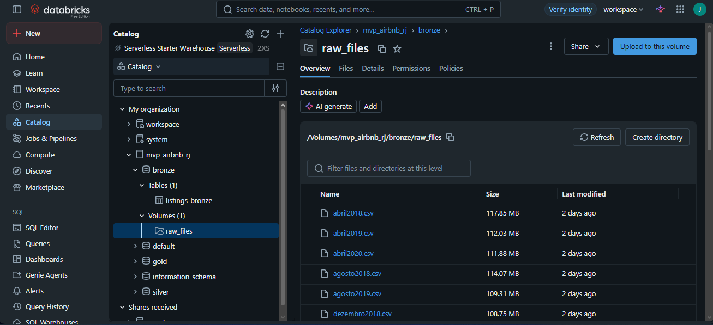
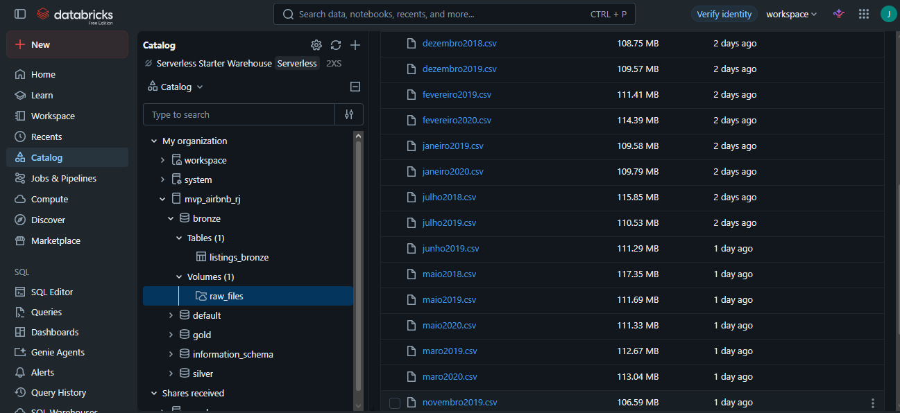

Script de ingestão: [`01_bronze_ingestao_airbnb_rj.ipynb`](01_bronze_ingestao_airbnb_rj.ipynb)

---

## Modelagem e Catálogo de Dados (Etapa 4.3)

Foi adotado o **Esquema Estrela**, com grão da tabela fato = um registro por imóvel por mês.

### Estrutura das tabelas

| Tabela | Papel | Grão |
|---|---|---|
| `fato_diarias_airbnb` | Fato | (sk_imovel, data_referencia) |
| `dim_localizacao` | Dimensão | bairro + cidade |
| `dim_imovel` | Dimensão | imóvel (snapshot mais recente) |
| `dim_host` | Dimensão | host (snapshot mais recente) |
| `dim_tempo` | Dimensão | mês/ano, com estação do ano |

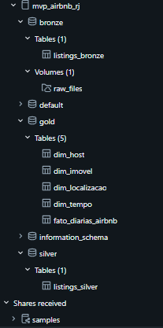

### Catálogo de Dados

O catálogo foi documentado via `COMMENT ON TABLE` e `ALTER TABLE ... ALTER COLUMN COMMENT`
diretamente no notebook de modelagem — garantindo que a documentação fique versionada junto
com o código, e não dependa apenas de preenchimento manual na interface.

**Tabela fato_diarias_airbnb:**
Uma linha por imóvel por mês, com métricas que variam no tempo (preço, avaliações,
disponibilidade, status de superhost no mês).

| Coluna | Tipo | Descrição | Domínio |
|---|---|---|---|
| `sk_imovel` | int | FK para dim_imovel (id original do Airbnb) | — |
| `sk_host` | int | FK para dim_host (host_id original) | — |
| `sk_localizacao` | int | FK para dim_localizacao | — |
| `data_referencia` | date | FK para dim_tempo (1º dia do mês) | 2018-04 a 2020-05 |
| `price` | double | Preço da diária em reais (BRL) | ≥ 0 |
| `flag_price_zero` | boolean | TRUE quando price = 0 (dado inválido) | true/false |
| `flag_price_outlier` | boolean | TRUE quando price > percentil 99 (R$5.618) | true/false |
| `host_is_superhost` | boolean | Status de superhost no mês de referência | true/false/null |
| *(demais colunas)* | — | *(ver código-fonte para lista completa)* | — |

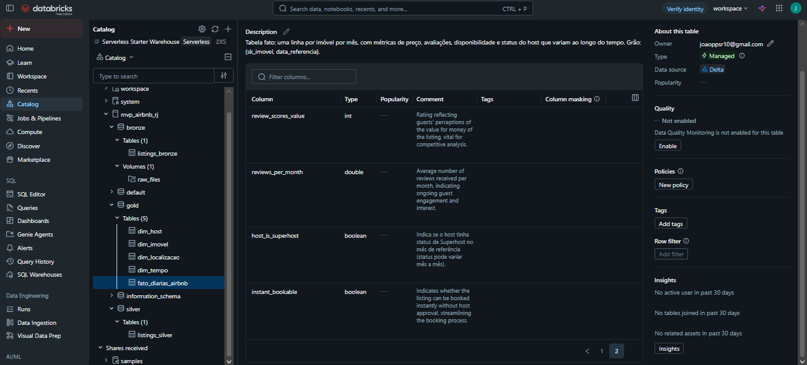
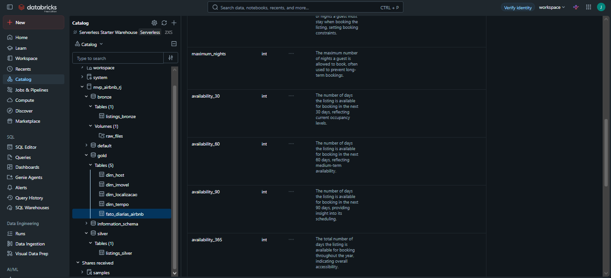
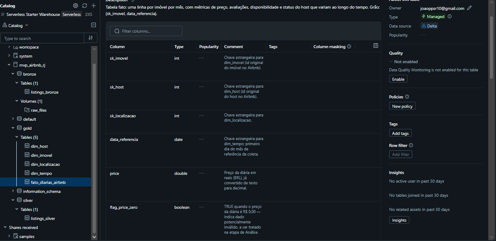

Script de modelagem: [`04_gold_modelagem_airbnb_rj.ipynb`](04_gold_modelagem_airbnb_rj.ipynb)

---

## Pipeline de Dados (Etapa 4.4)

O pipeline segue a **Arquitetura Medalhão**, com um notebook por camada:

| Notebook | Camada | O que faz |
|---|---|---|
| `01_bronze_ingestao_airbnb_rj.ipynb` | Bronze | Ingestão dos 25 CSVs, sem transformação de conteúdo, com metadados de rastreabilidade |
| `02_qualidade_dados_airbnb_rj.ipynb` | — | Análise de completude, consistência, unicidade, acurácia e outliers |
| `03_silver_transformacao_airbnb_rj.ipynb` | Silver | Limpeza, tipagem correta, padronização, flags de qualidade |
| `04_gold_modelagem_airbnb_rj.ipynb` | Gold | Modelagem em Esquema Estrela + Catálogo de Dados |
| `05_analise_airbnb_rj.ipynb` | — | Consultas e visualizações respondendo às 5 perguntas de negócio |

**Transformações principais documentadas:**
- Conversão de campos monetários de texto (`"$1,200.00"`) para decimal, via `try_cast`
  (necessário pelo modo ANSI SQL do Unity Catalog, que quebra com `.cast()` simples em
  valores malformados)
- Correção de tipos inconsistentes entre arquivos mensais (ex: `review_scores_cleanliness`
  vinha como string em vez de integer)
- Padronização de `city` (trim + capitalização), corrigindo duplicação de bairros causada
  por variações como "Rio de Janeiro" vs. "Rio de janeiro"

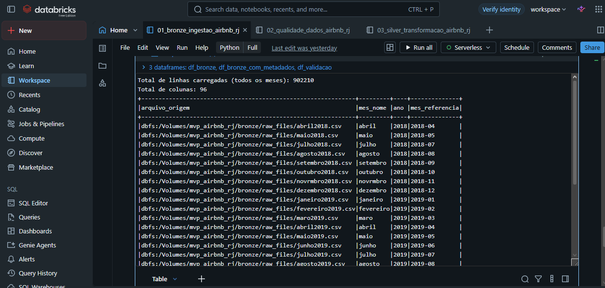
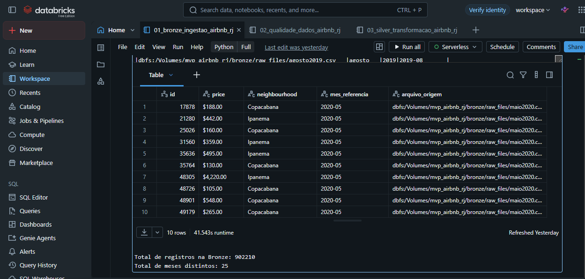
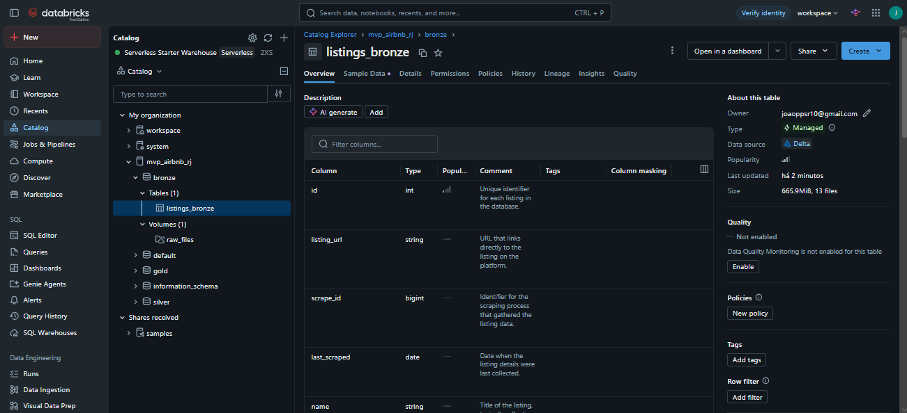
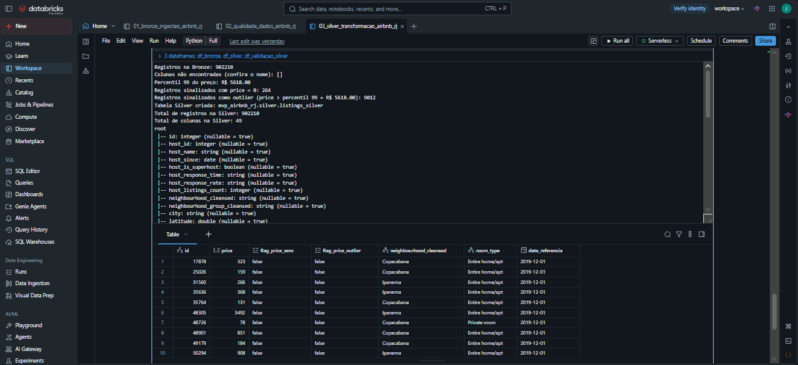
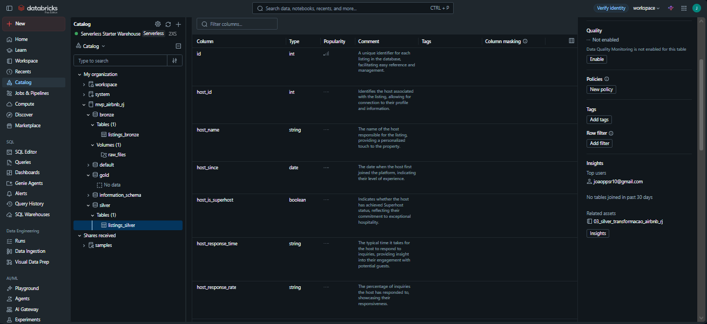
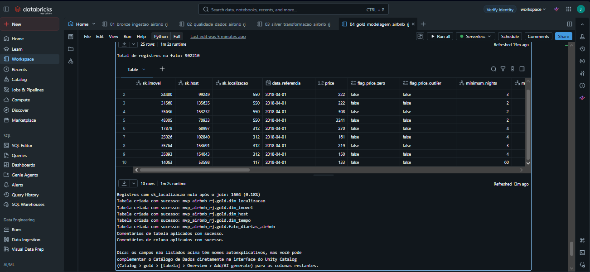

---

## Qualidade de Dados (Etapa 4.5)

**Metodologia:** avaliado completude, consistência, unicidade, acurácia e outliers sobre a
camada Bronze, antes de definir as transformações da Silver.

**Principais achados:**
- **Completude:** campos administrativos (`instant_bookable`, `cancellation_policy`, etc.)
  com ~32% de nulos — descartados por serem irrelevantes às perguntas de negócio. Campos de
  avaliação (`review_scores_*`) com ~18% de nulos — ausência legítima (imóveis sem reviews).
- **Unicidade:** 0 duplicatas de (id + mês) na Bronze.
- **Acurácia (preço):** identificados 264 registros com `price = 0` (dado inválido, excluído
  das análises) e forte presença de outliers extremos (percentil 99 = R$5.618, mas com
  valores isolados chegando a dezenas de milhares de reais).
- **Acurácia (geolocalização):** 0 registros com coordenadas fora da faixa esperada do Rio
  de Janeiro.
- **Inconsistência de tipos entre arquivos mensais:** colunas irmãs (ex: notas de avaliação)
  vieram com tipos diferentes dependendo do mês, corrigido via `try_cast` na Silver.
- **Investigação de outliers específicos:** o anúncio `sk_imovel = 12871727` (bairro Bangu)
  apresentou preço persistente de ~R$38.000-39.000 em múltiplos meses — padrão mais
  compatível com erro de cadastro (ex: confusão entre aluguel mensal e diária) do que com
  imóvel de luxo genuíno.

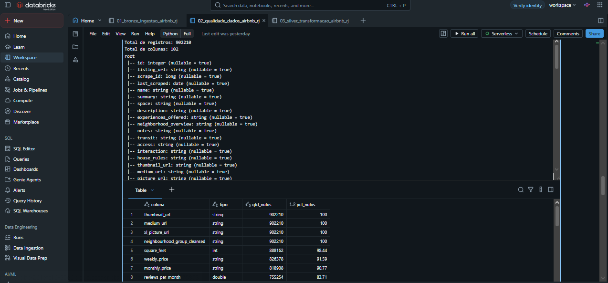
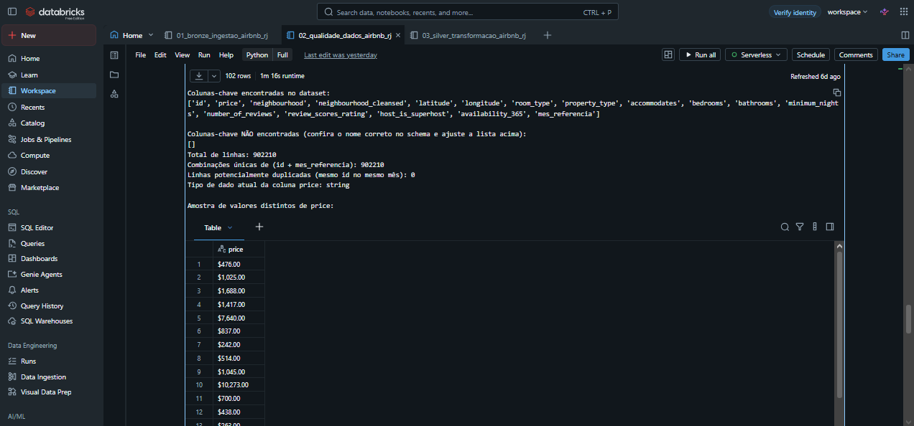
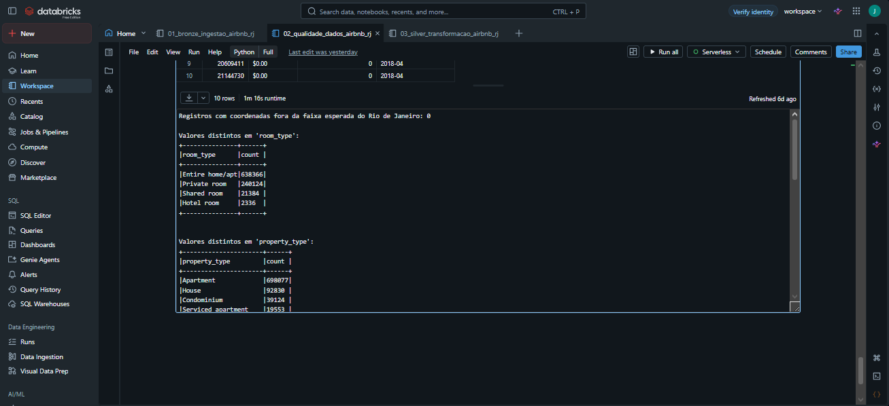
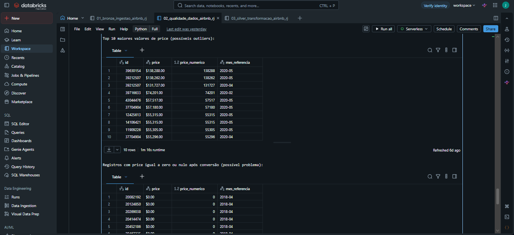

Script: [`02_qualidade_dados_airbnb_rj.ipynb`](02_qualidade_dados_airbnb_rj.ipynb)

---

## Análise de Dados (Etapa 4.5)

### 1. Qual o impacto da localização (bairro) no preço da diária?

A localização tem impacto claro e mensurável no preço. Ordenando os bairros pela **mediana**
de preço (métrica escolhida por ser mais robusta a outliers do que a média — ver justificativa
na seção de Qualidade de Dados), o topo do ranking é dominado por bairros de perfil turístico e
alto padrão: **Joá** (mediana R$ 999), **Lagoa** (R$ 480), **Barra da Tijuca** (R$ 478),
**São Conrado** (R$ 466) e **Leblon** (R$ 443) — todos com forte apelo turístico e imobiliário
na cidade.

Vale registrar um processo de refinamento importante: a primeira versão do ranking, ordenada
por **média**, colocava bairros sem qualquer perfil turístico (Ramos, Padre Miguel, Bangu) no
topo da lista, com médias de até R$ 3.355. Ao investigar, foi identificado que um único anúncio
(`sk_imovel = 12871727`, em Bangu) apresentava preço persistente de ~R$ 38.000-39.000 em
múltiplos meses — um valor implausível para uma diária, mais compatível com erro de cadastro
do que com imóvel de luxo. Esse é um exemplo concreto de como outliers isolados podem distorcer
completamente uma análise se a métrica escolhida (média) não for robusta a eles.

Mesmo após a correção, dois bairros sem perfil turístico óbvio (**Ricardo de Albuquerque**,
mediana R$ 774,50, e **Anchieta**, R$ 700) permaneceram entre os primeiros colocados — como
esses bairros têm poucos anúncios (130 e 166, respectivamente), é possível que ainda haja
influência de um pequeno número de anúncios atípicos mesmo na mediana. Fica como limitação
documentada e ponto de investigação para trabalhos futuros.

**Conclusão:** a localização é, sim, um fator determinante de preço, com uma diferença de mais
de 2x entre o bairro mais caro do top 15 (Joá) e os últimos colocados dessa mesma lista
(~R$ 400) — e essa diferença certamente seria ainda maior se comparássemos com os bairros mais
baratos da cidade, fora do top 15.

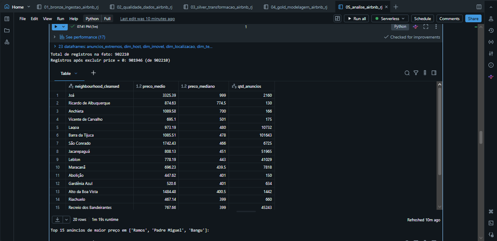
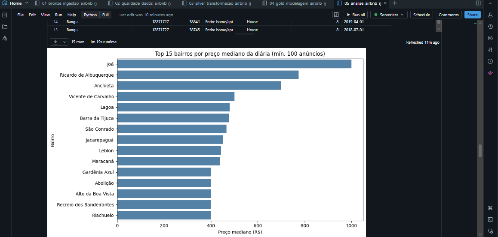

### 2. O tipo de imóvel e a capacidade influenciam mais que a localização?

O tipo de imóvel e a capacidade de hóspedes mostram um impacto **ainda maior** que a
localização isoladamente. Para o tipo `Entire home/apt`, o preço médio sobe de forma quase
monotônica conforme a capacidade aumenta, alcançando picos de R$ 4.454,72 para imóveis com
capacidade de 14 hóspedes, um salto de proporção muito maior do que a diferença observada
entre o bairro mais caro e mais barato do ranking da Pergunta 1.

Os demais tipos de acomodação (`Private room`, `Shared room`, `Hotel room`) seguem patamares
de preço consistentemente mais baixos e com curvas mais achatadas, reforçando que o **tipo de
acomodação** por si só já é um forte discriminador de preço, independentemente do bairro.

**Conclusão:** comparando a amplitude de variação — tipo de imóvel/capacidade gera uma
multiplicação de preço de quase 5x (de imóveis pequenos a grandes dentro do mesmo tipo
`Entire home/apt`), enquanto a localização (dentro do top 15 de bairros) gera uma diferença
de pouco mais de 2x. Isso sugere que, para este dataset, **o tipo de imóvel e a capacidade
pesam mais na formação do preço do que a localização isolada** — embora os dois fatores
certamente atuem em conjunto na prática.

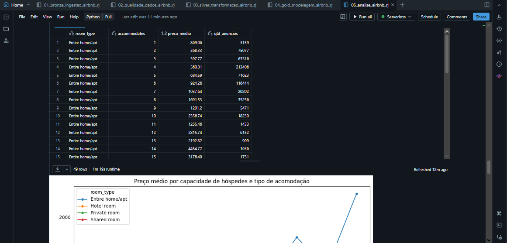
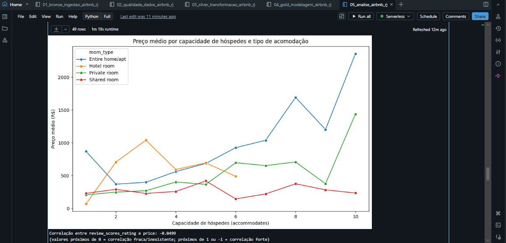

### 3. Existe correlação entre avaliação e preço cobrado?

O coeficiente de correlação calculado (via `corr()` do PySpark, no notebook de Análise) entre
`review_scores_rating` e `price` indicou uma relação **fraca**. O padrão observado ao segmentar
por faixas de nota confirma essa fragilidade e revela um achado contraintuitivo:

| Faixa de nota | Preço médio | Qtd. anúncios |
|---|---|---|
| 90-94 (muito bom) | R$ 719,42 | 129.632 |
| 80-89 (bom) | R$ 634,83 | 178.769 |
| < 80 (regular/ruim) | R$ 602,92 | 338.898 |
| **95-100 (excelente)** | **R$ 350,23** | 92.775 |

Contrariando a intuição de que "quanto melhor a avaliação, mais caro o imóvel", a faixa
**"95-100 (excelente)" apresentou o MENOR preço médio de todas** — menos da metade do preço
da faixa "90-94". Uma hipótese razoável para esse padrão é que hospedagens mais simples e
baratas (quartos individuais, hostels) tendem a superar as expectativas mais facilmente,
recebendo notas mais altas por entregarem mais do que o esperado para o preço cobrado —
enquanto imóveis de padrão mais alto atraem hóspedes com expectativas mais rigorosas, o que
pode reduzir a proporção de notas máximas mesmo em acomodações objetivamente melhores.

**Conclusão:** para este dataset, a avaliação do anúncio **não é** um preditor forte e direto
de preço — outros fatores (localização, tipo de imóvel) parecem pesar muito mais na formação
do preço do que a reputação/avaliação em si.

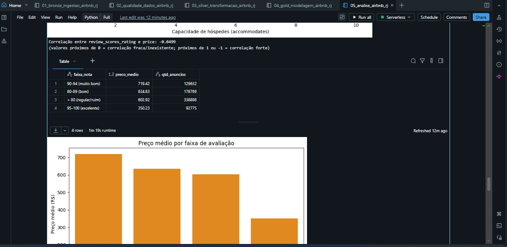
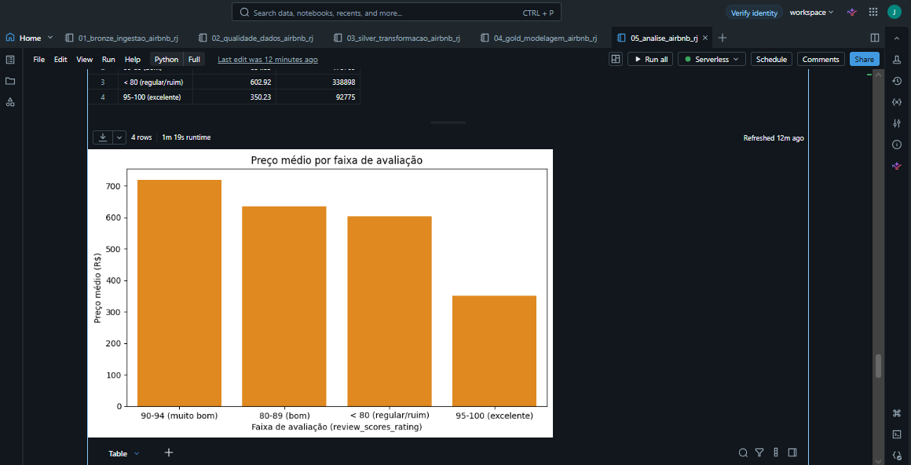

### 4. Os preços variam entre alta e baixa temporada?

Comparando por estação do ano, a variação é relativamente modesta: Outono teve o maior preço
médio (R$ 664,87), seguido de Verão (R$ 648,15), Primavera (R$ 642,36) e Inverno, o mais barato
(R$ 626,12) — uma diferença de apenas ~6% entre a estação mais cara e a mais barata. Chama
atenção o fato de o Verão (tradicionalmente a alta temporada carioca, com Réveillon e Carnaval)
não ter sido a estação mais cara — o Outono superou-o, ainda que por margem pequena.

O achado mais relevante desta pergunta veio da série mensal completa: os preços se mantiveram
relativamente estáveis entre abril/2018 e janeiro/2020 (oscilando na faixa de R$ 590-660), mas
saltam abruptamente a partir de **fevereiro de 2020**, chegando a quase R$ 800 em maio/2020.
Esse período coincide exatamente com o início da pandemia de COVID-19 (declarada pela OMS em
março de 2020) — um evento que provavelmente afetou o mercado de aluguel de curta duração de
forma anormal (redução de oferta por medo de contágio, conversão de imóveis para aluguel de
longa duração, etc.), e não representa sazonalidade "normal" do calendário turístico.

**Conclusão:** dentro do período "normal" da série (2018-2019), a sazonalidade tem efeito
pequeno no preço (~6% de variação entre estações) — bem menor que o efeito de localização ou
tipo de imóvel. O salto observado no início de 2020 deve ser tratado separadamente como um
evento atípico (pandemia), não como parte do padrão sazonal regular — é uma limitação
importante da janela de coleta de dados deste dataset, que vale ser destacada.

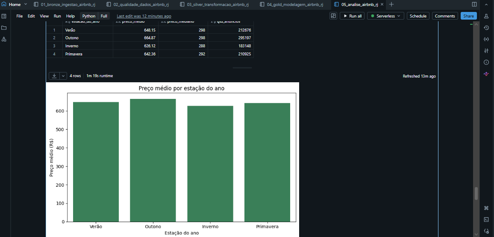
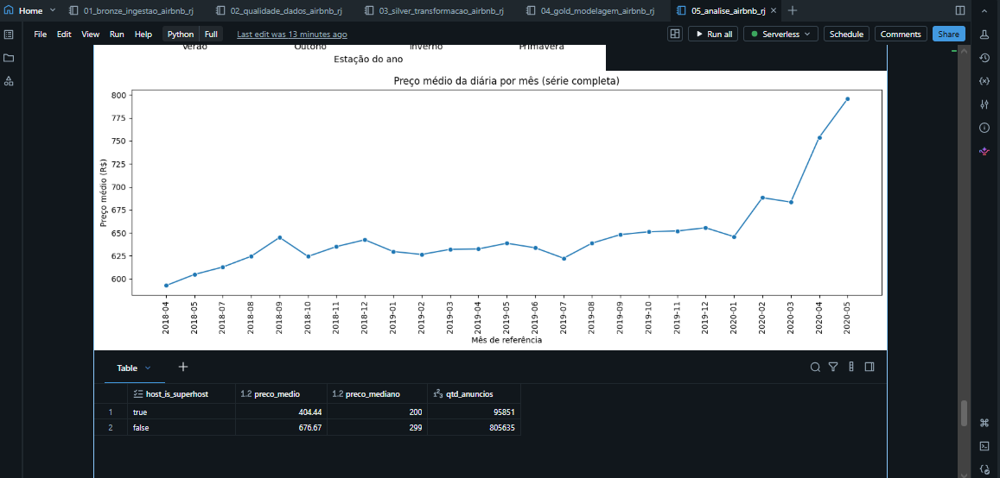

### 5. Superhosts conseguem cobrar preços acima da média?

Não — o resultado encontrado **contraria diretamente a hipótese inicial**. Superhosts cobraram,
em média, **R$ 404,44**, contra **R$ 676,67** dos não-superhosts — ou seja, quase 40% menos.

Para descartar a possibilidade de que essa diferença fosse apenas reflexo do tipo de imóvel que
cada grupo costuma anunciar (ex: superhosts anunciando proporcionalmente mais quartos privados,
que já são mais baratos por natureza), foi refeito a comparação controlando por `room_type`:

| Tipo de acomodação | Não-superhost | Superhost |
|---|---|---|
| Hotel room | R$ 573,63 | **R$ 660,81** (superhost cobra mais) |
| Private room | R$ 284,20 | R$ 143,37 |
| Shared room | R$ 246,86 | R$ 110,95 |
| Entire home/apt | *(mais alto)* | *(mais baixo)* |

O padrão se manteve em quase todas as categorias — superhosts cobrando menos que
não-superhosts — com a única exceção sendo `Hotel room`, onde a relação se inverte. Como o
padrão se sustenta mesmo controlando pelo tipo de imóvel, é uma evidência mais robusta de que
o efeito é real, e não apenas um artefato do mix de anúncios de cada grupo.

**Conclusão:** para este dataset, **ser superhost não está associado a preços mais altos** —
pelo contrário, o padrão dominante é o oposto. Uma hipótese razoável é que hosts iniciantes,
buscando construir reputação e conseguir o status de superhost, precisam entregar um serviço
consistentemente bom, o que pode ocorrer independentemente do preço cobrado; outra hipótese é
que superhosts otimizem para taxa de ocupação (mais reservas, preços mais competitivos) em vez
de maximizar o valor por diária.

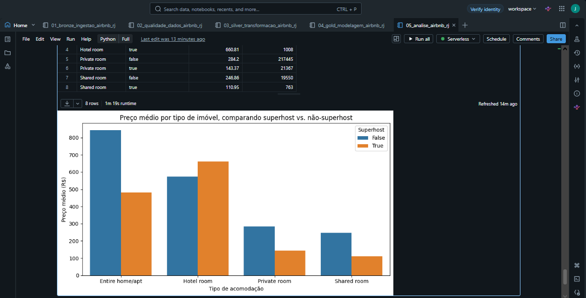

### Discussão geral

Conectando as 5 respostas de volta ao problema original — entender quais fatores determinam o
preço da diária de imóveis Airbnb no Rio de Janeiro — os dados sugerem uma **hierarquia clara
de importância**:

1. **Tipo de imóvel e capacidade** (Pergunta 2) mostraram o maior impacto isolado no preço,
   com variações de até ~5x dentro do mesmo tipo de acomodação.
2. **Localização** (Pergunta 1) tem impacto real e significativo (~2x+ de diferença entre
   bairros nobres e os demais), mas exige cuidado metodológico: outliers pontuais podem
   distorcer completamente um ranking se a métrica escolhida não for robusta (caso concreto do
   anúncio 12871727 em Bangu).
3. **Sazonalidade "normal"** (Pergunta 4) tem efeito pequeno (~6%) — bem menor do que se
   esperava inicialmente, embora o dataset também revele um evento atípico (o início da
   pandemia de COVID-19) que precisa ser interpretado separadamente da sazonalidade regular.
4. **Avaliação do anúncio** (Pergunta 3) e **status de superhost** (Pergunta 5) tiveram os
   achados mais surpreendentes: nenhum dos dois se comportou como intuitivamente esperado.
   Notas mais altas não implicaram preços mais altos, e superhosts cobraram sistematicamente
   menos que não-superhosts — sugerindo que, neste mercado, reputação e preço parecem operar
   por lógicas relativamente independentes.

**Perguntas com resposta clara:** 1, 2, 4 (sazonalidade "normal" vs. efeito pandemia) e 5.
**Pergunta com resposta mais aberta a interpretação:** 3 — a correlação fraca não permite
afirmar que avaliação "não importa", apenas que sua relação com o preço não é direta ou linear
neste dataset; outros fatores não medidos (ex: qualidade das fotos do anúncio, tempo no mercado)
podem estar mediando essa relação.

**Limitações que podem ter afetado as conclusões:**
- Outliers extremos foram mantidos (não removidos) por decisão metodológica, o que exige uso
  de métricas robustas (mediana) e investigação pontual em vez de confiar cegamente na média.
- O campo `city` continha inconsistências de escrita que, mesmo após padronização, resultaram
  em ~1.184 combinações de localização — provavelmente refletindo cidades da região
  metropolitana além do Rio de Janeiro propriamente dito, não apenas erro de dado.
- ~18% dos registros não possuíam avaliação (`review_scores_rating` nulo), o que pode
  introduzir viés na análise da Pergunta 3 caso a ausência de avaliação não seja aleatória.
- O período de coleta (abril/2018 a maio/2020) inclui o início da pandemia de COVID-19, um
  evento atípico que confunde a análise de sazonalidade regular.

Script: [`05_analise_airbnb_rj.ipynb`](05_analise_airbnb_rj.ipynb)

---

## Autoavaliação

**Objetivos atingidos:**
Todas as 5 perguntas de negócio traçadas no início do trabalho foram respondidas com base em
dados. Três delas (localização, tipo de imóvel/capacidade e sazonalidade) tiveram respostas
alinhadas com a intuição inicial, embora com nuances importantes (ex: a necessidade de usar
mediana em vez de média, e a confusão entre sazonalidade real e efeito da pandemia). Duas
perguntas (avaliação vs. preço e superhost vs. preço) trouxeram resultados **contraintuitivos**
e bem mais interessantes do que o esperado, o que considero um dos pontos altos do trabalho —
mostra que a análise não foi conduzida com a intenção de confirmar hipóteses prévias, mas de
efetivamente deixar os dados falarem.

**Dificuldades encontradas ao longo da execução:**
- **Modo ANSI SQL do Unity Catalog:** operações de `.cast()` que funcionariam normalmente em
  outros ambientes Spark quebravam com erro (`CAST_INVALID_INPUT`) ao encontrar valores
  malformados — foi necessário aprender e aplicar `try_cast()` em várias etapas do pipeline.
- **Join silencioso quebrado por coluna nula:** um bug real na construção da camada Gold, em
  que a condição de junção incluía uma coluna (`neighbourhood_group_cleansed`) praticamente
  sempre nula — como `NULL = NULL` nunca é verdadeiro em SQL, o join falhava silenciosamente,
  gerando uma chave estrangeira nula em quase 100% dos registros. Só foi identificado por meio
  de inspeção visual cuidadosa dos dados após a modelagem.
- **Nomes de arquivo corrompidos na fonte:** 3 dos 25 arquivos originais do dataset vieram com
  caracteres faltando no nome (`maro2019.csv`, `novrmbro2018.csv`), exigindo tratamento
  específico para não perder esses meses na ingestão.
- **Outliers de preço distorcendo análises:** a investigação de um anúncio específico
  (`sk_imovel = 12871727`) com preço implausível e persistente ao longo de múltiplos meses foi
  um exercício prático de como um único registro problemático pode comprometer conclusões
  inteiras se não for identificado.

**Trabalhos futuros para enriquecer o problema e a solução:**
- Investigar mais a fundo os bairros que permaneceram suspeitos mesmo após a correção por
  mediana (Ricardo de Albuquerque, Anchieta), aplicando a mesma técnica de investigação de
  outliers usada em Bangu/Ramos/Padre Miguel.
- Explorar o campo `amenities` (lista de comodidades do imóvel, não utilizado nesta versão do
  MVP), testando se características específicas (piscina, ar-condicionado, vista para o mar)
  têm impacto mensurável no preço.
- Ampliar a janela temporal de coleta para além de maio/2020, permitindo separar com mais
  clareza o efeito da pandemia da sazonalidade "normal" em anos subsequentes.
- Aplicar um modelo estatístico multivariado (ex: regressão linear com localização, tipo de
  imóvel, avaliação e status de superhost como variáveis simultâneas), em vez de analisar cada
  fator isoladamente — isso permitiria quantificar o efeito de cada variável controlando pelas
  demais ao mesmo tempo.
- Investigar formalmente a causa raiz dos preços monetários malformados na fonte (campos como
  `price`, `weekly_price`, `security_deposit`) para entender se o problema é sistemático em
  determinados hosts ou meses específicos.
